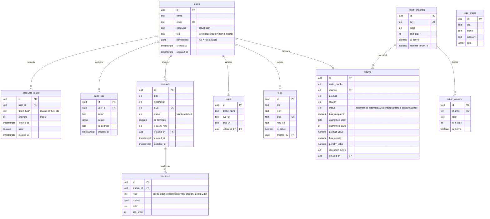

# Database / Banco de dados

| File | Purpose |
|---|---|
| `schema.sql` | Table structure only (PKs, FKs, indexes, constraints). No data. |
| `seed.sql` | 100% fictional demo data. All demo users share the password `Demo@1234`. |
| `migrations/` | Incremental changes for databases created with an older `schema.sql`. |

```bash
psql "$DATABASE_URL" -f database/schema.sql
psql "$DATABASE_URL" -f database/seed.sql
```

On Supabase you can also paste both files into the **SQL Editor**. The backend uses three public
**Storage buckets** that must be created manually: `logos`, `images` and `tools`.

## Entity-relationship diagram



`size_charts` is standalone (used by the embedded size-chart tool). `returns.reason` stores the
reason **label** as text, so historical records survive if a reason is renamed or deleted.

> The schema was reverse-engineered from the queries in `src/controllers/`. /
> O schema foi deduzido das queries em `src/controllers/`.
